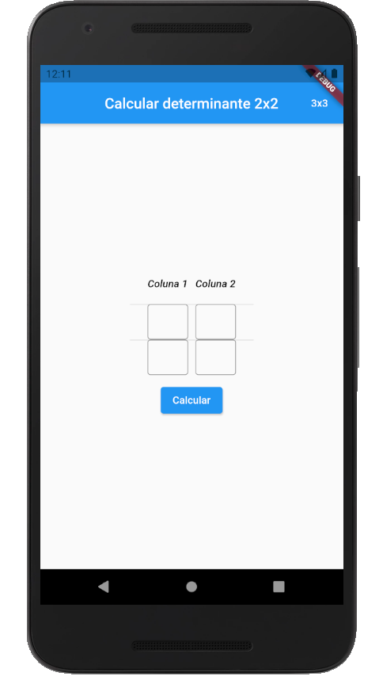
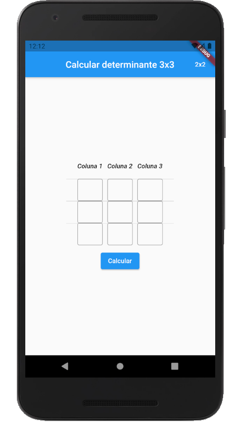
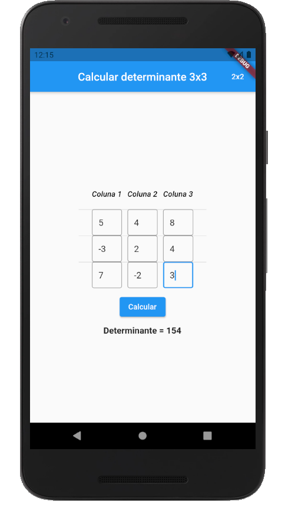
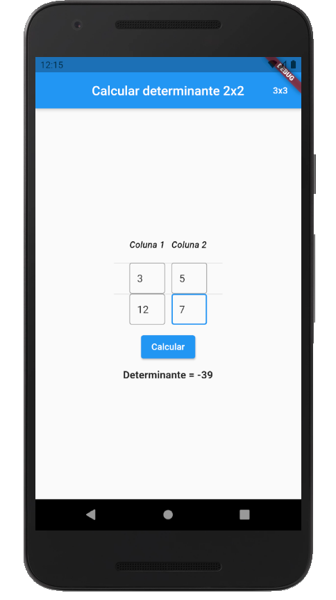

<h2 align="center">
  Calculadora de Determinantes
</h2>

 

<h3 align="center">
  
  
</h3>

---

## 📃 Sobre

**Calculadora de Determinantes** é um projeto mobile desenvolvido com Flutter durante a aula da faculdade.

O **objetivo** do projeto é que a pessoa possa calcular de forma mais prática os determinantes de matrizes 2x2 e matrizes 3x3.

Para poder calcular determinantes de matrizes 3x3, é só clicar neste botão que fica localizado na `AppBar` (barra do topo azul à direita), e para voltar para o cálculo de determinantes de matrizes 2x2, é só clicar no botão localizado na mesma área.

## ⭐ Imagens da aplicação
 

## 🚀 Tecnologias e recursos utilizados

Este projeto foi desenvolvido com as seguintes tecnologias:
- [**Visual Studio Code**](https://code.visualstudio.com/): um editor de código-fonte desenvolvido pela Microsoft, que é multiplataforma e muito utilizado;
- [**Dart**](https://dart.dev/): Linguagem de programação;
- [**Flutter**](https://flutter.dev/): Uma UI Toolkit que traz várias facilidades para desenvolvimento Cross-Platform;

## 🔧 Instalação e execução

Para você poder instalar e executar esta aplicação, será preciso ter instalado o git para clonar este repositório e ter a SDK do Flutter instalada na máquina para poder executar o projeto.
 
Só com isso já é possível buildar o APP.

<h5 align="center">
  &copy;2021 - <a href="https://github.com/matheusEduardoTavares">Matheus Eduardo Tavares</a>
</h5>